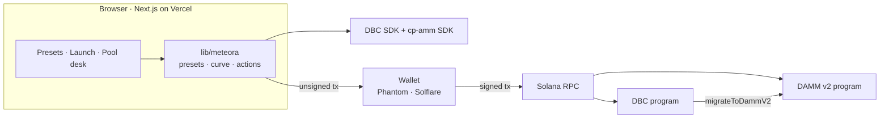
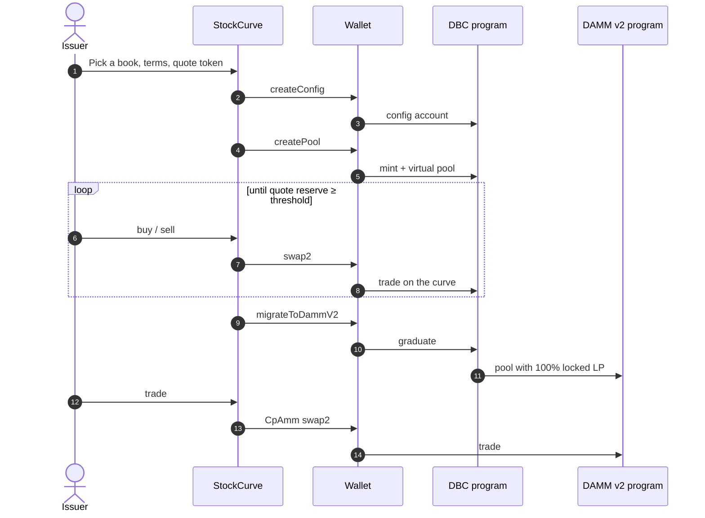

# StockCurve

Equity and RWA launch desk on Solana. Price discovery runs on Meteora Dynamic Bonding Curve. A finished curve graduates into a Meteora DAMM v2 pool. Builders start from reusable books instead of a meme curve.

Hackathon track: Meteora DBC + DAMM v2, Superteam / Crypto World's Fair.

**Live app:** https://meteora-dbc-dammv2.vercel.app (devnet by default)

| | |
| --- | --- |
| Architecture, user flow and sequence diagrams | [docs/ARCHITECTURE.md](docs/ARCHITECTURE.md) |
| Investor deck | [StockCurve Investor Deck](https://claude.ai/artifact/51uGb5a9z78sABD6ZPe6GU) |
| Judge checklist | [JUDGES.md](JUDGES.md) |

## 60-second judge walkthrough

1. Open https://meteora-dbc-dammv2.vercel.app. To run locally instead: `npm install && cp .env.example .env.local && npm run dev`, then open http://localhost:3000.
2. The homepage chart is the real **Desk Flat** curve, price against SOL raised, traced from the DBC config segments (no wallet). Hover it for the price at any point. Preset cards show each book's own curve shape.
3. Open **Presets**. Read Flat / Long / Exponential. Click **paid**. Prime Book stays locked. The **Judge demo unlock** switch is labeled and collects no SOL. Leave it off unless you want to sign that preset.
4. Open **Launch**, keep Desk Flat, quote SOL, profile **Sandbox**, and continue to Review. The prospectus quote comes from `getQuoteFromInputAmount`.
5. **Connect wallet** in the header (Devnet selected) with Phantom or Solflare and faucet SOL. **Create config and pool** asks for two signatures: `createConfig`, then `createPool`. The lifecycle turns green only after each signature confirms. The Book page then lists the pool.
6. On the pool desk, pick **Buy**, then **Get quote** and **Sign buy**. That is `swapQuote2` / `swap2` on the live DBC pool.
7. **Graduate to DAMM v2** stays disabled until the quote reserve reaches the threshold. The button then signs `migrateToDammV2`. When `CpAmm.isPoolExist` is true, **Get quote** / **Sign DAMM swap** in the DAMM v2 card trade the graduated pool.

No wallet nearby: `npm run preview-curves` builds every preset and quotes a buy. `npm run build-config-tx` builds an unsigned `createConfig` transaction aimed at the DBC program. Neither script sends anything.

Devnet has no migration keeper, so the desk button is the graduation path. Mainnet keepers migrate eligible pools at **10 SOL** or **750 USDC** when you choose the keeper profile.

## Why these books are not a meme launchpad

A generic launchpad sells a steep curve, a huge supply, and unlocked LP. StockCurve is built for names that trade like thinly listed equity:

- **Flat** sells a large share of the float with a 30 bps fee, so price discovery stays near a reference price.
- **Long** adds liquidity into the graduation price and decays the fee over 24 hours, so the book thickens instead of spiking.
- **Exponential** is the listing event: a wide opening fee on a thin book, decaying over 6 hours, with a much higher graduation cap.
- **Thin Book** keeps a 100 bps fee plus Meteora's dynamic fee for pairs that will not trade all day.
- **Issuer Lock** returns no unlocked LP. 80% of graduated DAMM v2 liquidity is permanently locked to the issuer and 20% to the config partner.

The same config object is what gets signed on devnet or mainnet. Sandbox thresholds let a judge finish a curve with faucet SOL. Keeper thresholds are the mainnet path keepers already watch.

## Architecture

No backend holds keys or funds. The browser builds each transaction with Meteora's SDKs, the wallet signs, and the RPC confirms. All state lives in Meteora's DBC and DAMM v2 programs.



Lifecycle of one listing:



The UI records a step only after the RPC confirms its signature. Full system diagram, user flow, lifecycle state machine and one sequence diagram per transaction: [docs/ARCHITECTURE.md](docs/ARCHITECTURE.md).

## Meteora integration map

Program ids are the same on devnet and mainnet.

| Program | ID |
| --- | --- |
| DBC | `dbcij3LWUppWqq96dh6gJWwBifmcGfLSB5D4DuSMaqN` |
| DAMM v2 | `cpamdpZCGKUy5JxQXB4dcpGPiikHawvSWAd6mEn1sGG` |

| What the judge sees | SDK method | File |
| --- | --- | --- |
| Preset curve | `buildCurve`, `buildCurveWithLiquidityWeights`, `buildCurveWithTwoSegments` | `lib/meteora/curve.ts` |
| Review-step buy quote, before a pool exists | `pool.getQuoteFromInputAmount` | `lib/meteora/curve.ts` |
| First signature | `partner.createConfig` | `lib/meteora/actions.ts` |
| Second signature | `creator.createPool` | `lib/meteora/actions.ts` |
| Pool address | `deriveDbcPoolAddress` | `lib/meteora/actions.ts` |
| Desk progress | `state.getPool`, `state.getPoolConfig`, `state.getPoolQuoteTokenCurveProgress` | `lib/meteora/actions.ts` |
| Curve quote | `pool.swapQuote2` | `lib/meteora/actions.ts` |
| Curve swap | `pool.swap2` | `lib/meteora/actions.ts` |
| Graduation gate | quote reserve compared with `migrationQuoteThreshold` | `graduationBlockReason` in `lib/meteora/actions.ts` |
| Graduation signature | `migration.migrateToDammV2` | `lib/meteora/actions.ts` |
| Graduated pool address | `deriveDammV2PoolAddress` and `DAMM_V2_MIGRATION_FEE_ADDRESS[Customizable]` | `lib/meteora/curve.ts`, `lib/meteora/actions.ts` |
| DAMM v2 existence | `CpAmm.isPoolExist`, `CpAmm.fetchPoolState` | `lib/meteora/actions.ts` |
| DAMM v2 quote and swap | `CpAmm.getQuote2`, `CpAmm.swap2` | `lib/meteora/actions.ts` |

`migrateToDammV2` also returns two position-NFT keypairs. They partial-sign locally. The connected wallet pays. If the threshold is not met, or the pool is already migrated, the transaction is not built.

Docs: [DBC](https://docs.meteora.ag/developer-guides/dbc), [DAMM v2](https://docs.meteora.ag/developer-guides/damm-v2), [DBC SDK](https://github.com/MeteoraAg/dynamic-bonding-curve-sdk), [DAMM v2 SDK](https://github.com/MeteoraAg/damm-v2-sdk).

## Superteam submission

**Blurb:** StockCurve is a launch desk for tokenized equity. Issuers pick a flat, long, or exponential Meteora DBC book sized for thin markets, trade through price discovery, and graduate into permanently locked DAMM v2 liquidity. Presets are reusable. A paid-preset slot is ready for a real payment rail and stays honest until one exists.

**Demo video:** Show the homepage curve, the locked Prime Book, two devnet signatures, a DBC swap, and the disabled graduation button with the reserve short of the threshold. If the curve is filled, show `migrateToDammV2` confirm and a DAMM v2 quote. Do not cut in a success state that the RPC did not confirm.

**Live app:** https://meteora-dbc-dammv2.vercel.app

**Source access:** If this repository is ever made private, add GitHub user `dannxbt` with Read.

A one-page checklist is in [JUDGES.md](JUDGES.md).

## Run it

```bash
npm install
cp .env.example .env.local
npm run dev
```

Devnet SOL: https://faucet.solana.com. Devnet USDC mint: `4zMMC9srt5Ri5X14GAgXhaHii3GnPAEERYPJgZJDncDU`. Mainnet USDC: `EPjFWdd5AufqSSqeM2qN1xzybapC8G4wEGGkZwyTDt1v`.

```bash
npm run preview-curves
npm run build-config-tx
npm run typecheck
npm run build
```

## Environment

`.env.example` separates the devnet demo from the mainnet path. No secrets belong in the repo.

| Variable | Use |
| --- | --- |
| `NEXT_PUBLIC_SOLANA_NETWORK` | `devnet` or `mainnet-beta`. The header switch overrides it in the browser. |
| `NEXT_PUBLIC_SOLANA_RPC_URL` | RPC while the header says devnet. |
| `NEXT_PUBLIC_MAINNET_RPC_URL` | RPC while the header says mainnet-beta. Replace the public URL before a live listing. |
| `NEXT_PUBLIC_DEMO_UNLOCK_PAID_PRESETS` | `true` unlocks Prime Book for a judge demo and the UI says no SOL was collected. Leave unset otherwise. |
| `PRESET_PAYMENT_WEBHOOK_URL` | Empty slot for a future payment backend. Unused. |

## Mainnet path

1. Set `NEXT_PUBLIC_SOLANA_NETWORK=mainnet-beta` and your own `NEXT_PUBLIC_MAINNET_RPC_URL`.
2. Select **mainnet-beta** in the header and **keeper** in the wizard so the threshold is at least 10 SOL or 750 USDC.
3. Host real metadata. `public/token-metadata.json` is a template.
4. Sign the same two transactions. Meteora keepers can migrate a completed eligible pool. The desk can still build `migrateToDammV2`.
5. Trade DAMM v2 after `CpAmm.isPoolExist` is true.

A sandbox threshold on mainnet is still a real pool. Keepers will not pick it up below their published minimums. Manual graduation on the desk still works once that smaller threshold fills.

## Preset payment extension

`lib/marketplace/access.ts` exports `PresetAccessProvider`. Free presets pass. Paid presets fail closed. `decidePresetAccess(preset, true)` is only the judge demo flag. A production provider should return `allowed` after a verified SOL transfer, NFT, or server receipt, and should not reuse the demo flag for that.

## Project layout

```
app/                       Next.js pages
components/                Launch wizard, pool desk, preset browser, lifecycle
lib/meteora/curve.ts       Preset to DBC config and pre-pool quotes
lib/meteora/actions.ts     Config, pool, swap, graduation gate, DAMM v2
lib/marketplace/access.ts  Free presets, locked paid presets, demo unlock
scripts/preview-curves.ts  Offline SDK checks, including the graduation gate and curve profile
docs/ARCHITECTURE.md       Architecture, user flow, lifecycle and sequence diagrams
```

TypeScript, Next.js App Router, `@solana/web3.js` 1.x, and the wallet adapter. `next.config.ts` stubs Node builtins so the browser bundle can load the Meteora SDKs.
