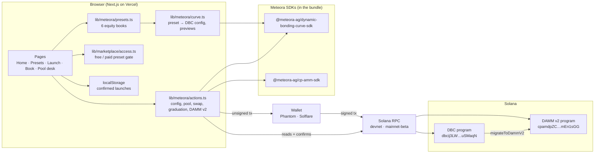
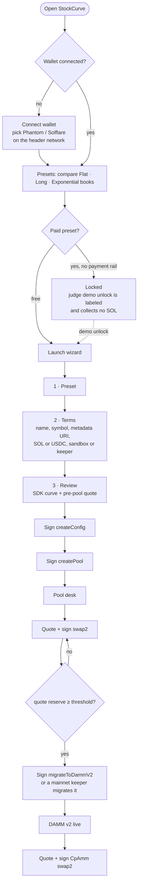
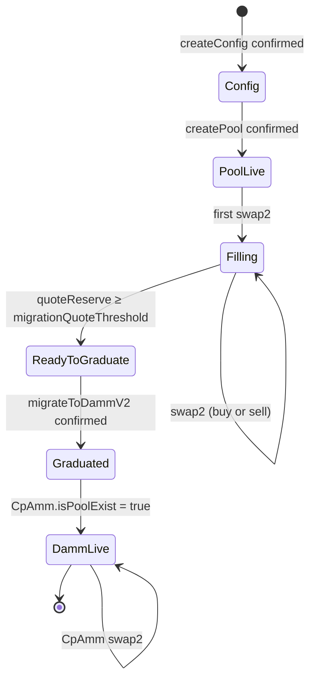
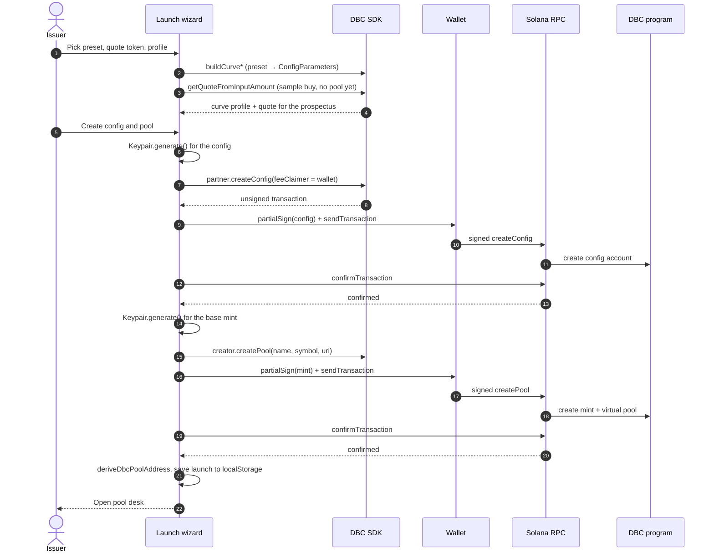
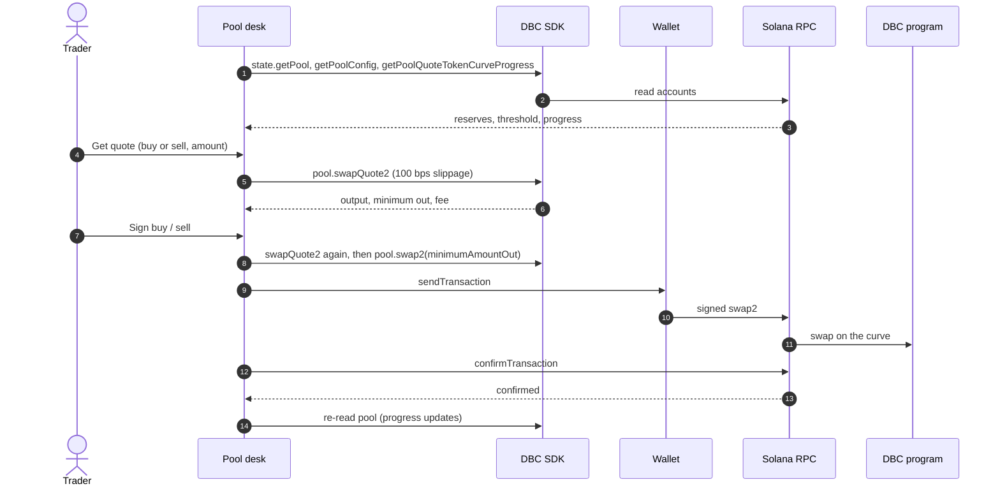
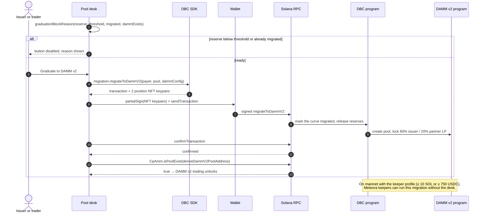
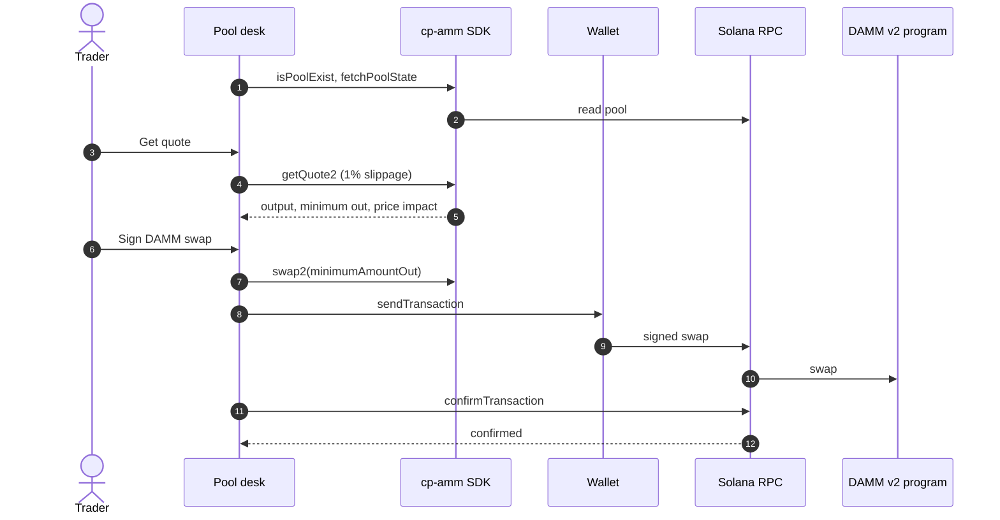

# StockCurve architecture

How StockCurve turns a preset into a Meteora DBC pool and graduates it into Meteora DAMM v2. Every diagram below matches the code in `lib/meteora/` and `components/`.

- [System architecture](#system-architecture)
- [User flow](#user-flow)
- [Pool lifecycle](#pool-lifecycle)
- [Sequence: launch](#sequence-launch-createconfig--createpool)
- [Sequence: trade the curve](#sequence-trade-the-curve)
- [Sequence: graduate](#sequence-graduate-to-damm-v2)
- [Sequence: trade DAMM v2](#sequence-trade-damm-v2)
- [Where the code lives](#where-the-code-lives)

## System architecture

StockCurve has no backend that holds keys or funds. The browser builds every transaction with Meteora's SDKs, the user's wallet signs, and the signed transaction goes straight to a Solana RPC. All on-chain state lives in Meteora's programs.

Design choices:

- **No custom program.** StockCurve composes Meteora's audited programs instead of deploying its own, so there is nothing extra to audit and no upgrade key.
- **No server signer.** New keypairs (the config account, the base mint, and the two DAMM v2 position NFTs) are generated in the browser and partial-sign locally; the connected wallet pays and signs.
- **Confirmed means confirmed.** The UI marks a step done only after `confirmTransaction` returns without an error. Launches are saved to `localStorage` only after both launch signatures confirm.
- **Same ids on both clusters.** DBC and DAMM v2 use the same program ids on devnet and mainnet; the header switch only changes the RPC and the quote mints.

## User flow

## Pool lifecycle

The five stages the app shows in its lifecycle tracker, and what moves a pool between them.

`graduationBlockReason` in `lib/meteora/actions.ts` decides whether the **Graduate** button is enabled: the pool must exist, must not be migrated already, the DAMM v2 pool must not exist yet, and the quote reserve must have reached the threshold.

## Sequence: launch (createConfig → createPool)

## Sequence: trade the curve

## Sequence: graduate to DAMM v2

## Sequence: trade DAMM v2

## Where the code lives

| Concern | File |
| --- | --- |
| Preset definitions (shape, fees, LP lock, price) | `lib/meteora/presets.ts` |
| Preset → `ConfigParameters`, curve profile, pre-pool quote | `lib/meteora/curve.ts` |
| Every transaction builder and chain read | `lib/meteora/actions.ts` |
| Paid-preset gate | `lib/marketplace/access.ts` |
| Wallet button, picker and account menu | `components/WalletConnect.tsx` |
| Network switch and Solana providers | `components/Providers.tsx` |
| Launch wizard | `components/LaunchWizard.tsx` |
| Pool desk (curve swaps, graduation, DAMM v2) | `components/PoolDesk.tsx` |
| Price vs. raised chart | `components/CurveChart.tsx` |
| Offline SDK checks | `scripts/preview-curves.ts`, `scripts/build-config-tx.ts` |
